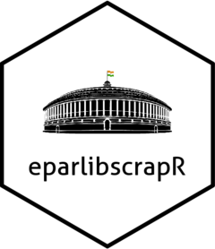

eparlibscrapR 

### Introduction

This is a simple web scraper built on `rvest` and packages from the `tidyverse` to collect and organise data from searches on the Parliament of India's [Digital Library](https://eparlib.nic.in). It returns a data frame with details including the pdf link of each search result. Refer to this [help guide](https://eparlib.nic.in/help/help_doc.pdf) for more information and familiarise yourself with the [website](https://eparlib.nic.in) before using `eparlibscrapR`. 

### Functions

At present, this package offers two functions, and each takes a different search filter as input:

1. `scrape_qna`: For searches filtered by type "Part 1(Questions and Answers)" which includes only questions asked on the floor of the Lok Sabha.

2. `scrape_nonqna`: For searches filtered by type "Part 2(Other Than Questions and Answers)", which includes Government Bills, Private Member's Bills, Committee Reports, etc.

This is to accommodate the differences in elements of the two search types.

### Future Steps

Development is underway to create:

1. A simpler function to work on search URLs with any or no filter.

2. A function to scrape, read, and tidy PDFs from the search results.

### Contribute

Spotted a bug? Report [here](https://github.com/avkarandikar/eparlibscrapR/issues). Want to contribute to code development? Open a pull request [here](https://github.com/avkarandikar/eparlibscrapR).

### Author's Declaration

`eparlibscrapR` (hereafter, "this Package") is neither affiliated with nor endorsed by the [Parliament Digital Library](https://eparlib.nic.in/) (hereafter, "the Entity").

This Package is created for systematic collection of data available in the public domain in support of research and study.

All users of this package are hereby advised to refer to these [webscraping guidelines](https://towardsdatascience.com/ethics-in-web-scraping-b96b18136f01) and make ethical use of this Package.

The development of this Package, or any use of this Package for any purpose, by itself or in combination with, or as the basis for other packages, or any analyses resultant thereof, does not in any way imply the official positions of, nor hold liable, the Entity.

All attempts have been made to comply with the [Terms and Conditions](https://eparlib.nic.in/help/terms-conditions.jsp) and the [Copyright Policy](https://eparlib.nic.in/help/copyright-policy.jsp) of the Entity. The Author of this Package is neither responsible nor liable for any misuse or non-compliance with the said Terms and/or Policies by any third party.

This Package has been licensed under the [GNU General Public License v3.0](https://github.com/avkarandikar/eparlibscrapR/blob/main/LICENSE.md).

Any third party use of this Package for any purpose, by itself or in combination with, or as the basis for other packages, or any analyses resultant thereof, does not amount to an endorsement by, imply the positions of, or hold liable, the Author of this Package. Any subsequent work which uses this Package must also be made available under the same license, as per the terms of using material licensed under the [GNU General Public License v3.0](https://www.gnu.org/licenses/gpl-3.0.en.html).

The Author of this Package is not responsible for changes in availability of information or non-availability of the same on any of the above-mentioned websites.

#### About Logo

The logo is adapted from [this image](https://commons.wikimedia.org/wiki/File:Indian_Parliament.svg) shared on Wikimedia Commons with a [CC BY-SA 4.0 license](https://creativecommons.org/licenses/by-sa/4.0/deed.en), which requires that any reuse or adaptation of work licensed under the same be made available under the same or compatible licence, and be attributed to the original author. The R package [`eparlibscrapR`](https://github.com/avkarandikar/eparlibscrapR) which uses [this image](https://commons.wikimedia.org/wiki/File:Indian_Parliament.svg) as the basis for its logo is made available on [GitHub](https://github.com/avkarandikar/eparlibscrapR) with a [GPL-3.0 License](https://www.gnu.org/licenses/gpl-3.0.html), declared as a [compatible license to CC BY-SA 4.0](https://creativecommons.org/share-your-work/licensing-considerations/compatible-licenses).

Original file: https://commons.wikimedia.org/wiki/File:Indian_Parliament.svg \
Attribution: Suthir, [CC BY-SA 4.0](https://creativecommons.org/licenses/by-sa/4.0), via Wikimedia Commons.
